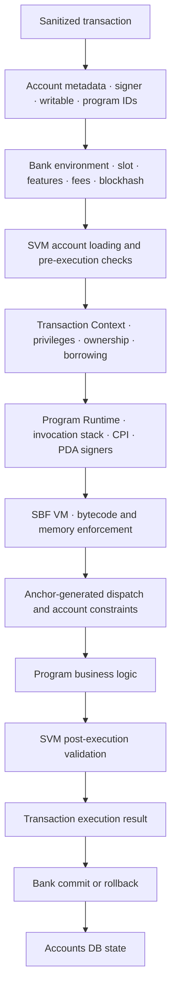

> These are **conceptual architecture diagrams**, not Rust ownership trees. An arrow labeled `calls`, `uses`, or `loads through callback` represents a runtime relationship—not structural containment.

## 1. Validator Overall Architecture

```text
Validator
├── Transaction Pipelines
│   ├── TPU
│   │   └── Banking Stage
│   │       └── 调用 Bank 生产区块
│   │
│   └── TVU
│       └── Replay Stage
│           └── 调用 Bank 重放区块
│
├── Bank
│   ├── Slot / Epoch / FeatureSet
│   ├── Fee / Blockhash / Nonce
│   │
│   ├── Accounts
│   │   └── Accounts DB
│   │       ├── Accounts Index
│   │       ├── Accounts Cache
│   │       └── AppendVec
│   │
│   ├── 创建并调用 SVM
│   │   └── TransactionBatchProcessor
│   │       ├── Account Loader
│   │       │   └── 通过 Callback 向 Bank/Accounts 加载账户
│   │       │
│   │       ├── Transaction Processor
│   │       │   ├── 创建 Transaction Context
│   │       │   ├── 执行交易
│   │       │   └── 执行后验证
│   │       │
│   │       └── 调用 Program Runtime
│   │           ├── Invoke Context
│   │           ├── CPI / Syscalls
│   │           │
│   │           └── 执行程序
│   │               ├── Builtin Program
│   │               │   └── 原生 Rust 函数
│   │               │
│   │               └── SBF VM
│   │                   └── 执行链上 SBF 程序
│   │                       ├── 原生 Solana 程序
│   │                       └── Anchor 生成的程序
│   │                           ├── Dispatcher
│   │                           ├── Accounts 校验
│   │                           └── 业务逻辑
│   │
│   └── 消费 SVM 结果
│       ├── Commit
│       └── Rollback
│
└── Consensus
    ├── Bank Forks
    ├── Fork Choice
    ├── Voting
    └── Root
```

The key relationship is:

```text
Bank calls SVM
  → SVM loads accounts through a callback
  → Program Runtime invokes a builtin or the SBF VM
  → SBF VM executes on-chain program bytecode
  → SVM validates the result
  → Bank consumes the result and commits or rolls back state
```

Important corrections:

- `Bank` is **outside** the SVM; it is the validator-side caller and result consumer.
- `Accounts DB` is not inside the SVM. The SVM accesses account state through callbacks supplied by its consumer.
- `Anchor` is not part of the SBF VM. Anchor generates program code that is compiled to SBF and executed by the VM.
- TPU/TVU stages call into Bank; they are transaction pipelines, not children of the SVM.

## 2. Smart Contract Audit Path



### What to Audit at Each Boundary

| Boundary | Main audit questions |
| --- | --- |
| Transaction → SVM | Are account order, signer flags, writable flags, program IDs, and remaining accounts used safely? |
| Account loading | Can the wrong account, program version, fee payer, or nonce state be selected? |
| Transaction Context | Can signer/writable privileges, ownership, aliases, or mutable borrows be abused? |
| Program Runtime / CPI | Are privileges propagated correctly? Are PDA signer seeds and CPI targets verified? |
| SBF VM boundary | Are input regions, stack/heap limits, compute units, syscalls, and bytecode assumptions relevant to the bug? |
| Anchor-generated checks | Do constraints actually enforce owner, address, seeds, mint, authority, token program, close, and realloc rules? |
| Business logic | Are authorization, arithmetic, state transitions, oracle assumptions, and economic invariants correct? |
| Post-execution validation | Does runtime validation catch the mutation, and what does it deliberately not understand about business logic? |
| Commit / rollback | Which account changes survive success or failure? What happens to fees and durable nonce state? |

## Responsibility Boundary

The runtime enforces protocol privileges, ownership rules, legal account mutations, atomicity, and runtime invariants. The program must still enforce authority, PDA, token, oracle, remaining-account, business-state, and economic invariants.

In short: the runtime can prove that a state change is **protocol-valid**. It cannot prove that the state change is **correct for the application's intended business rules**.

## Official References

- [Anza Validator Anatomy](https://docs.anza.xyz/validator/anatomy)
- [Anza Runtime](https://docs.anza.xyz/validator/runtime)
- [Agave SVM Specification](https://github.com/anza-xyz/agave/blob/master/svm/doc/spec.md)
