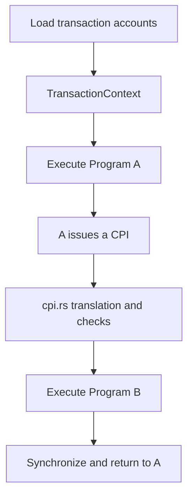
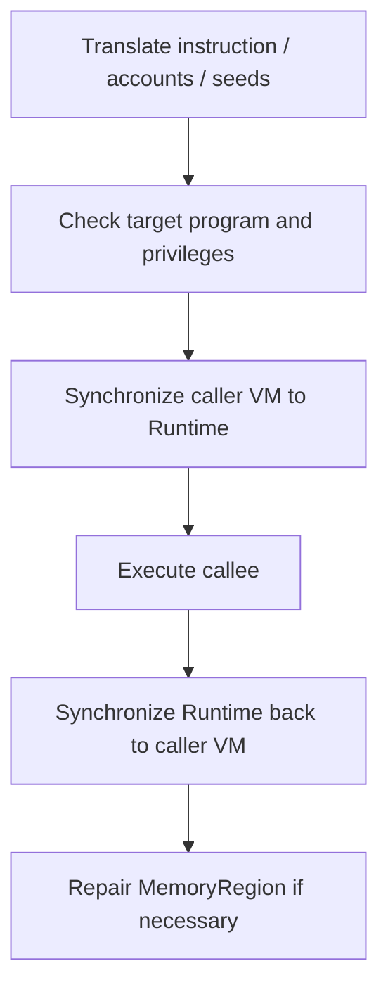

## 1. Where `cpi.rs` Fits in the Runtime

`cpi.rs` handles the following:

> When the current program invokes another program through CPI, how are the arguments safely parsed, privileges checked, accounts synchronized, and the nested invocation entered?

It is not responsible for loading the entire transaction from `AccountsDB`, nor does it implement the business logic of a program instruction. It comes into play after program execution has already begun and the program is preparing to issue a CPI:



In this call relationship:

- **caller**: the parent program that initiates the CPI, such as Program A;
- **callee**: the child program invoked through CPI, such as Program B;
- **child instruction**: the instruction created by A at runtime to invoke B.

---

## 2. Three Layers of Account State

The key to understanding `cpi.rs` is not to begin with any particular function, but to first distinguish the following three layers.

### 2.1 `AccountsDB`: Committed State

`AccountsDB` stores the validator's currently committed on-chain account state.

```text
Pubkey
lamports
owner
data
executable
rent_epoch
```

### 2.2 Runtime Accounts: The Authoritative Account State for the Current Transaction

At the beginning of a transaction, the Runtime loads the relevant accounts from `AccountsDB` into the `TransactionContext`. During program execution, they are usually accessed through `BorrowedInstructionAccount`.

Here, a "real account" does not mean the final version stored on disk. It means:

> The authoritative account state recognized by the Runtime during execution of the current transaction and ultimately used to determine what will be committed.

### 2.3 VM `AccountInfo`: The Account View Visible to an On-Chain Program

An SBF program is untrusted code and cannot arbitrarily access the validator process's memory. The Runtime serializes arguments and accounts into VM-accessible regions, or maps controlled account memory in direct-mapping mode, and then uses `AccountInfo` to tell the program the relevant addresses and privileges.

The default copy-based mode can be pictured as follows:

```text
Host 0xAAA0: Runtime data = [1, 2, 3]
Host 0xBBB0: VM input copy = [1, 2, 3]
VM   0x4000: mapped to Host 0xBBB0
```

The program executes:

```rust
account.data[0] = 9;
```

At this point, the state may be:

```text
VM copy:        [9, 2, 3]
Runtime account: [1, 2, 3]
```

These are two different memory regions, so they are not synchronized automatically. Instead, the Runtime synchronizes them at explicit boundaries:

```text
CPI occurs: synchronize to the Runtime before the CPI, then back to the caller afterward
No CPI:        process everything together when the current instruction finishes
```

If the transaction ultimately fails, the Runtime's working state is not committed back to `AccountsDB`.

---

## 3. What Is `MemoryMapping`?

An SBF program uses VM virtual addresses, while the validator uses host addresses. `MemoryMapping` is the translation table between the two, and it also records access ranges and permissions.

For example:

```text
VM range    0x4000..0x4064
Host range  0x7f00_0000..0x7f00_0064
Permissions readable / writable
```

When a program accesses VM address `0x4020`, the Runtime computes the offset from the start of the region:

```text
0x4020 - 0x4000 = 0x20
Host address = 0x7f00_0000 + 0x20
```

Functions such as `translate_type()` and `translate_slice()` typically:

1. Find the `MemoryRegion` containing the VM address;
2. Check length, bounds, permissions, and alignment;
3. Compute the corresponding host address;
4. Return a Rust reference or slice.

A VM address cannot be dereferenced directly as a host pointer. Doing so could both crash the process and break VM isolation.

---

## 4. Responsibilities of the Three Context Types

### `TransactionContext`

The container for the entire transaction's accounts and call stack:

- Stores the Runtime accounts loaded for the transaction;
- Stores the top-level instruction and CPI call frames;
- Supports borrowing accounts by transaction index.

### `InstructionContext`

The account view for one particular invocation level:

- Which accounts the current instruction uses;
- The ordering of those accounts;
- Signer and writable privileges;
- Instruction data;
- The mapping between indices at the current invocation level and transaction account indices.

When A invokes B through CPI, A and B each have their own `InstructionContext`, but the underlying Runtime accounts still belong to the same `TransactionContext`.

### `InvokeContext`

The overall controller created by the Runtime for program execution in the current transaction. It usually contains or connects to:

- `transaction_context`;
- `compute_meter`;
- the feature set;
- VM `memory_contexts`;
- the program cache;
- the log collector;
- the compute budget and execution cost;
- program execution, call-stack, and CPI control logic.

This can be condensed to:

```text
TransactionContext = data for the entire transaction
InstructionContext = data view for the current invocation
InvokeContext      = controller for the overall execution process
```

---

## 5. Why Both `SolAccountInfo` and `AccountInfo` Exist

They describe the same concept but correspond to different language ABIs.

### C ABI: `SolAccountInfo`

This structure is relatively flat and directly stores:

```text
lamports_addr
data_addr
data_len
owner_addr
```

### Rust ABI: `stable::AccountInfo`

This corresponds to the stable memory layout of the SDK's `AccountInfo`. The Rust version internally involves:

```text
Rc<RefCell<&mut u64>>
Rc<RefCell<&mut [u8]>>
```

Therefore, `lamports_addr` and `data_addr` initially point to fields inside wrapper structures. A fixed offset must be added before another address translation is performed.

This is also why there are two entry points:

```rust
from_account_info()      // Rust AccountInfo layout
from_sol_account_info()  // C SolAccountInfo layout
```

Both ultimately produce the same `CallerAccount`.

`#[repr(C)]` fixes field order and alignment. Compile-time assertions using `offset_of!`, `size_of!`, and `align_of!` ensure that the Runtime's stable structure remains compatible with the SDK layout.

---

## 6. `CallerAccount`

`CallerAccount` is neither a new account nor the actual Runtime account. It is:

> A temporary collection of references that the Runtime uses to locate and modify account fields in the caller's VM.

Its main fields are:

```rust
lamports               // reference to lamports in the caller VM
owner                  // reference to owner in the caller VM
original_data_len      // original length at the start of the current top-level instruction
serialized_data        // serialized copy of data in the caller VM
vm_data_addr           // VM address corresponding to data
ref_to_len_in_vm       // reference to the data-length field in the VM
```

It serves two synchronization operations:

```text
Before CPI: caller VM → Runtime account
After CPI:  Runtime account → caller VM
```

`get_serialized_data()` obtains a writable `&mut [u8]` based on the VM address and length. It also checks whether the account data exceeds the original length plus the permitted growth allowance. When direct mapping is enabled, no serialized copy is needed, so the function may return an empty slice. An empty slice does not mean that the account data itself is empty; it only means that this synchronization buffer is not used.

---

## 7. The Argument-Translation Layer: Unifying Rust and C

The `SyscallInvokeSigned` trait defines the work that both language entry points must perform:

```rust
trait SyscallInvokeSigned {
    fn translate_instruction(...) -> Result<Instruction, Error>;
    fn translate_accounts(...) -> Result<Vec<TranslatedAccount>, Error>;
}
```

Its purpose is:

```text
Rust ABI ─┐
          ├→ Runtime Instruction / TranslatedAccount
C ABI ────┘
```

The higher-level `cpi_common<S>()` depends only on this trait and does not need to know whether the arguments originally came from Rust or C.

Common Rust syntax in this code includes:

- `::<T>`: the turbofish syntax, used to explicitly specify a generic type;
- `MaybeUninit<AccountMeta>`: initially treats untrusted VM bytes as a "possibly uninitialized value," avoiding the premature assumption that they form a valid Rust object;
- `T`: the input account-structure type;
- `R`: the return type after callback processing;
- `cb`: a callback that lets the common translation logic hand off to Rust- or C-specific follow-up processing;
- `#[expect(clippy::...)]`: indicates that a particular Clippy warning is intentional.

---

## 8. Translating PDA Signers

`translate_signers()` takes the caller's `program_id` and signer seeds from VM memory, and returns:

```rust
Vec<Pubkey>
```

This is the list of PDAs that receive signer privileges for the current CPI.

The seeds form a two-dimensional structure:

```rust
[
    [b"vault", alice.as_ref()],
    [b"reward", alice.as_ref()],
]
```

- Outer layer: multiple PDA signers;
- Inner layer: multiple seeds required to derive one PDA.

Each seed group is passed to:

```rust
Pubkey::create_program_address(&seeds, caller_program_id)
```

This derives a PDA. The caller's Program ID is used because only the caller can authorize, for this CPI, a PDA signer that it controls.

---

## 9. Account Matching: Who the Callee Wants and Whether the Caller Actually Supplied It

`translate_account_infos()` first performs the general VM-array translation:

1. Check whether the `AccountInfo` array address is valid;
2. Translate it into `&[T]`;
3. Check the account-count limit;
4. Charge CUs according to the number of AccountInfo bytes;
5. Translate each account's `Pubkey`;
6. Pass the results to a callback for further processing.

`translate_accounts_common()` then performs the actual matching:

```text
The callee instruction requires Vault
→ Search for Vault in the caller's AccountInfo public-key list
→ Find its index in the caller instruction
→ Construct a CallerAccount
→ Produce a TranslatedAccount
```

`TranslatedAccount` records:

```rust
index_in_caller               // account index in the caller
caller_account                // account view in the caller VM
update_caller_account_region  // whether the memory mapping must be repaired after CPI
update_caller_account_info    // whether account contents must be synchronized after CPI
```

For duplicate accounts, only the first occurrence is processed. If the callee references an ordinary account that the caller did not supply, `MissingAccount` is returned.

### Why Check `executable`?

A CPI account list may contain program accounts. For example:

```text
A → B (staking program) → Token Program
```

The accounts passed from A to B may include Vault, User, and the executable Token Program. Ordinary accounts require data synchronization. Program code is managed by the Runtime and is not synchronized like ordinary data accounts; here, the primary operation is charging CUs according to its data size.

---

## 10. `cpi_common()`: The Main Flow of a CPI

`cpi_common<S>()` is the main flow shared by Rust and C CPIs. Its inputs are the VM addresses of the instruction, AccountInfo values, and signer seeds, and its output is either a success code or an error.

The complete flow is:



In more detail:

1. Charge the fixed `invoke_units` cost for initiating a CPI;
2. Read feature gates and alignment settings;
3. Use `S::translate_instruction()` to translate the child instruction;
4. Obtain the caller's Program ID from the current `InstructionContext`;
5. Derive PDA signers from the seeds;
6. Use `check_authorized_program()` to reject unsupported Loader or precompile paths;
7. Use `prepare_next_cpi_instruction()` to perform account matching and signer/writable privilege checks;
8. Translate the caller's AccountInfo values;
9. Before the CPI, synchronize the caller's changes into the Runtime accounts;
10. Use `process_instruction()` to actually execute the callee;
11. After the CPI, synchronize the callee's changes back to the caller;
12. If realloc changed the underlying region, replace the caller VM's `MemoryRegion`;
13. Return `SUCCESS`.

The privilege rules include:

```text
A readonly account cannot be escalated to writable
A non-signer cannot be arbitrarily escalated to signer
A valid invoke_signed PDA can become a signer
The callee cannot use an account that the caller did not supply
```

---

## 11. The Three Account-Update Functions

### `update_callee_account()`: Before Entering the CPI

Direction:

```text
caller VM AccountInfo → Runtime BorrowedAccount
```

It synchronizes lamports, data length, data contents, and owner so that the callee sees the caller's latest changes.

The owner must be updated last. If the caller transfers ownership first, it may immediately lose permission to modify lamports or data.

A return value of `true` indicates that changes to the account pointer, length, or ownership require the caller's region to be updated when the CPI returns.

### `update_caller_account()`: After Exiting the CPI

Direction:

```text
Runtime BorrowedAccount → caller VM AccountInfo
```

It synchronizes the callee's changes to lamports, owner, data, and length, while also:

- Checking whether realloc exceeds the permitted limit;
- Zeroing the discarded area when shrinking;
- Updating the length of the `AccountInfo::data` slice;
- Updating the length field in the serialized parameters;
- Copying the data contents when direct mapping is not enabled.

### `update_caller_account_region()`: Repairing the Address Mapping

If the callee executes:

```rust
account.realloc(200, false)?;
```

The underlying data buffer and its length may change, so the caller's original VM `MemoryRegion` may become stale. This function finds the old region, creates or modifies a region based on the latest Runtime account, and replaces the old one through `replace_region()`.

It is `unsafe` because the Rust compiler cannot prove that the account buffer referenced by the raw pointer remains valid for the entire lifetime in which the `MemoryMapping` uses it. The source-code comments explain that this operation restores a caller account region that already existed before the CPI and whose lifetime is guaranteed by the invocation flow.

---

## 12. Why Are There So Many Pointer Checks?

The `AccountInfo` structure itself is also located in VM memory that an untrusted program can manipulate. Safe Rust normally does not arbitrarily modify its internal pointers, but a malicious program can use C, `unsafe`, or handwritten SBF instructions to forge:

```text
data_addr
lamports_addr
owner_addr
key_addr
```

The Runtime therefore compares the addresses returned by the program with the expected addresses recorded during serialization. Otherwise, the program could trick the Runtime into treating unrelated VM memory as account fields.

Neither `wrapping_add()` nor `saturating_add()` is, by itself, a safety check.

---

## 13. How Compute Units Are Consumed Across CPI

The caller and all nested callees share the same `ComputeMeter`:

```text
A → B → C
└────all charges come from the same CU budget
```

CPI-related costs include:

- The fixed `invoke_units` cost for initiating a CPI;
- Translating `AccountInfo` values;
- Processing or copying account data according to its byte size;
- Processing data for executable accounts;
- The SBF instructions actually executed by the callee;
- Syscalls and deeper nested CPIs.

For example:

```text
Transaction budget                   200,000 CU
Already executed by A                 20,000
Fixed CPI and argument-processing cost 1,500
Actual execution by B                 30,000
Remaining                            148,500
```

A large program binary does not necessarily make every execution expensive. The primary cost still depends on the actual code path, number of accounts, data size, copying, and CPI depth. However, if a task exceeds the per-transaction limit, it must be optimized or split across multiple transactions; splitting it sacrifices single-transaction atomicity.

---

## 14. A Complete CPI Example

Assume the initial balance stored in Vault's data is `100`:

```text
Program A's VM copy: 100
Runtime account:     100
```

A first changes it to `80`, but the change has not yet been synchronized:

```text
A's VM copy:    80
Runtime account: 100
```

A invokes B through CPI:

1. The Runtime translates the instruction, AccountInfo values, and PDA seeds passed by A;
2. It checks B, the privileges, and account matching;
3. `update_callee_account()` synchronizes `80` into the Runtime;
4. B reads `80` and then changes it to `50`;
5. When B returns, the Runtime account contains `50`;
6. `update_caller_account()` synchronizes `50` back into A's VM;
7. If B also performed a realloc, `update_caller_account_region()` repairs A's mapping;
8. A continues execution from the CPI call site and reads `50`.

This is the behavior that all of the translation, checking, and synchronization code in `cpi.rs` ultimately exists to guarantee.

---

## 15. Summary

In brief:

> The caller places Rust- or C-ABI CPI arguments in its own SBF VM memory. Through `MemoryMapping`, the Runtime translates those addresses, derives PDA signers, matches transaction accounts, and checks privileges. Before entering the callee, the Runtime synchronizes the caller VM's uncommitted account changes into the transaction's authoritative working accounts. After the callee finishes, it synchronizes the changes back into the caller VM and repairs the `MemoryRegion` if realloc changed the underlying address. All invocations share the same transaction account state, call stack, and Compute Meter.
