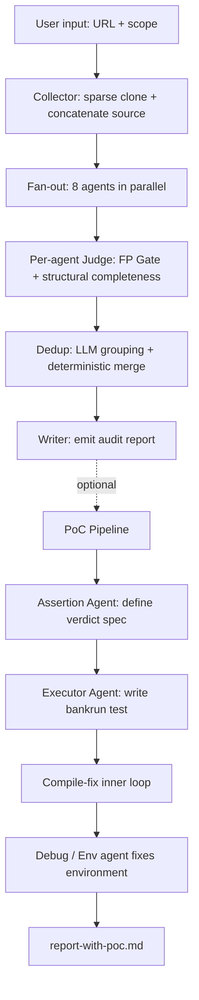

`solana-spear` is a multi-agent Solana audit workflow. The idea in one line:

> Have multiple agents with orthogonal viewpoints look for bugs independently. A finding that is hit by N agents AND survives the judge earns high confidence.

To let "N agents hit the same bug" turn into a real signal, dedup is the most critical stage in the whole pipeline.

---

## Architecture



Two stages: the **main pipeline** produces the finding report; the **PoC pipeline** takes that report and does a second, executable verification.

---

## The Four Layers of Signal in One Run

Inside the main pipeline, a finding passes through four gates from generation to final report:

```text
Collector  →  Agent (fan-out)  →  Judge (per-agent)  →  Dedup (aggregate)
 get source     generate raw       label valid/reject     group + vote
```

Each gate has a single responsibility and deliberately does not reuse the previous gate's judgment. Generation, filtering, and aggregation are three separate stages: fan-out only enumerates from many viewpoints, judge handles structural completeness and the FP Gate, dedup handles cross-agent grouping and voting.

---

## 1. Collector

Collector does three things:

1. **Sparse + shallow + partial-blob clone**: only pull directories inside `scope`, using `--depth 1 --filter=blob:none`, with a single batched lazy-fetch at checkout time. Blobs outside `scope` never touch disk.
2. **Filter by suffix and path**: keep only `.rs`, drop `tests/ test/ benches/ examples/ fuzz/ target/ .anchor/ migrations/`, plus files like `tests.rs / error.rs / event.rs` that carry no business logic.
3. **Concatenate into one source blob**: each file prefixed with `===== FILE: <rel_path> =====`. This blob is the user message every agent sees.

```python
def concat_source(repo_root: Path, files: list[Path]) -> str:
    parts: list[str] = []
    for f in files:
        rel = f.relative_to(repo_root)
        content = f.read_text(encoding="utf-8", errors="replace")
        parts.append(f"===== FILE: {rel} =====\n{content}\n")
    return "\n".join(parts)
```

Token budget is a hard constraint: warn at 180k, hard cap at 220k. Anything over the cap is bounced back to the user to narrow scope — the pipeline never truncates silently.

---

## 2. Fan-out: Eight Orthogonal Agents

`config.py` defines eight agents, each backed by a long checklist under `prompts/`:

| Agent | Viewpoint | Checklist coverage |
|---|---|---|
| `Arithmetic` | numeric / overflow | checked_add/mul, cast truncation, div-by-zero, round-down to 0, fixed-point scale |
| `AccessControl` | signer / privilege | signer/authority confusion, missing admin gate, PDA seed escalation, init front-running |
| `AccountValidation` | account checks | owner check, discriminator, has_one, address, mint, ATA, type cosplay |
| `CPI` | cross-program | arbitrary CPI, invoke_signed seed leak, Anchor bypass, transfer-hook reentrancy |
| `SPL-Token2022` | token extensions | transfer fee, CPI guard, interest-bearing, transfer hook, non-transferable mint |
| `Economic` | incentives | first depositor inflation, donation attack, liquidation incentive, flashloan composition |
| `Invariant` | invariants | sum of user balances == vault, x*y ≥ k, health factor, supply conservation |
| `MoneyFlow` | fund flow | source/sink, CEI violation, self-transfer, asymmetric multi-path |

Each agent's system prompt = `shared-rules.md` (finding format + attacker mindset) + its own checklist; the user message is the source blob.

Fan-out scheduling:

```python
task_by_name = {n: asyncio.create_task(_wrapped(n, f)) for n, f in AGENTS.items()}
refresher = asyncio.create_task(_refresher())     # repaint live panel every second
watcher   = asyncio.create_task(_stall_watcher()) # cancel task if idle > 600s
results   = await asyncio.gather(*task_by_name.values())
```

The stall watcher tracks a `last_tok_change` timestamp per agent and cancels the task if output tokens have not grown for 600 seconds — a defence against SSE stalls hanging the whole run.

---

## 3. Per-agent Judge: The FP Gate

Raw findings from fan-out go into the judge, and **each agent is judged separately**, never merged:

```python
async def run_judge(client, judge_prompt, agent_outputs, model):
    sem = asyncio.Semaphore(JUDGE_MAX_CONCURRENCY)  # 4
    async def _run(name, out):
        async with sem:
            text, tokens, err = await _judge_one(client, judge_prompt, name, out)
            return name, text, tokens, err
    results = await asyncio.gather(*[_run(n, o) for n, o in agent_outputs.items()])
```

The judge prompt (`judging.md`) is a hard FP Gate:

```text
Every finding must pass the following checks, or it is rejected:
1. Has a concrete attack path (not pure theory)
2. Entry point is reachable by the attacker
   (check Anchor constraints, Signer types, has_one, PDA-only instructions)
3. No existing guard already blocks this attack
   (require!, if-revert, reentrancy flags all named)
4. Does not require a privileged caller
   (admin / upgrade authority / multi-sig do not count)
5. Attack path is complete (not "missing one step" hand-waved as an exploit)
6. Not self-harm only (affecting only the attacker's own funds does not count)
7. Does not rely on specific token behavior (Token-2022 extensions, transfer
   hook) unless the target token actually supports it
8. Does not depend on an external precondition
   (oracle failure, bridge delay, runtime version constraint)
```

Plus a structural-completeness reject: missing description / root cause / impact / fix in any of them → reject; exploitable but no attack step written → reject; involves an amount but no numbers given → reject.

Findings that the judge rejects are still emitted in full, with `state = reject` and a reason attached. **The judge's output count always equals its input count** — it only labels, never deletes — because dedup depends on those reject signals for voting.

---

## 4. Dedup

### 4.1 Grouping signals: Title / Root Cause / Fix must all match

The dedup prompt (`prompts/dedup.md`) uses three hard criteria:

```text
1. Title points to the same specific defect — not "both are overflow" as a
   category, but the same concrete flaw
2. Root cause is the same code defect — same variable, same branch, same
   missing check, not "both are in this function"
3. Fix lands on the same modification — if two findings' fixes touch
   different code locations or different content, they are not the same bug
```

Fix is the strictest filter: if two findings' fixes do not land on the same code location, they are not considered the same bug.

Plus one anti-over-merge constraint:

```text
Special note: if two findings' Fns do not overlap at all, they are almost
never the same bug. Do not merge on Title wording similarity alone.
```

The `Fns` field is a required list of function names each finding hits. Refusing to merge when function names do not overlap prevents the LLM from doing shallow matching on Title wording.

### 4.2 One LLM call across all findings

`_dedup_all` sends every finding plus the source blob to the LLM in a single tool call and gets back the grouping:

```python
DEDUP_TOOL = {
    "name": "submit_groups",
    "input_schema": {
        "type": "object",
        "properties": {
            "groups": {
                "type": "array",
                "description": "Each inner array is a group of finding numbers (1-based). Same group = same bug. Every number MUST appear exactly once.",
                "items": {"type": "array", "items": {"type": "integer"}, "minItems": 1},
            },
            "project_name": {"type": "string"},
        },
        "required": ["groups"],
    },
}
```

One call vs. pairwise: pairwise is O(N²) — 40 findings means 780 calls, plus you have to compute the transitive closure yourself. One full-batch call lets the LLM output the equivalence-class partition directly; the price is that the source blob must ride along in the context.

### 4.3 Sanitize: LLM missing a number must self-heal

The most common failure mode of `groups` is missing numbers — 40 findings in, only 37 come back. The sanitize layer guarantees every number appears exactly once:

```python
def _sanitize_groups(raw_groups: list, n: int) -> list[list[int]]:
    """Ensure every number 1..n appears exactly once. Drop extras/duplicates;
    missing numbers become trailing singletons."""
    seen: set[int] = set()
    clean: list[list[int]] = []
    for g in raw_groups or []:
        this = []
        for idx in g:
            if isinstance(idx, int) and 1 <= idx <= n and idx not in seen:
                this.append(idx)
                seen.add(idx)
        if this:
            clean.append(this)
    for i in range(1, n + 1):
        if i not in seen:
            clean.append([i])
    return clean
```

The default behavior is "if missed, treat as un-merged," not "if missed, drop." The final report's finding count is always ≤ the input count.

### 4.4 Deterministic merge

Once groups are decided, merge no longer calls the LLM at all:

```python
def merge_group(findings: list[Finding]) -> Finding:
    v = sum(f.v for f in findings)
    r = sum(f.r for f in findings)
    appearances = sum(f.appearances for f in findings)
    agents = _dedup_preserve_order([a for f in findings for a in f.agents])
    fns    = _dedup_preserve_order([fn for f in findings for fn in f.fns])
    return Finding(
        title=_pick_longest([f.title for f in findings]),
        description=_pick_longest([f.description for f in findings]),
        root_cause=_pick_longest([f.root_cause for f in findings]),
        # ...
        v=v, r=r, appearances=appearances,
        state_label=_final_label(v, r),
    )
```

Rules:

- **Counter fields sum**: `v`, `r`, `appearances` are all added together.
- **List fields union**: `agents`, `fns` are order-preserving deduplicated.
- **Text fields pick longest**: `title`, `description`, `root_cause`, `attack_step`, `impact`, `fix` all take the longest string in the group.

Picking the longest text instead of letting the LLM rewrite pins the finding's content to a real string produced by a real agent — no new LLM generation enters at the merge stage.

### 4.5 Vote aggregation: V / R / appearances

The final state comes from `_final_label` operating on the summed V and R:

```python
def _final_label(v: int, r: int) -> str:
    if r > 1:  return "reject"
    if r == 1: return "worth a check"
    return "valid"
```

| Situation | Final label | Meaning |
|---|---|---|
| Multiple agents said valid, none rejected | `valid` | high confidence |
| Exactly one agent's judge rejected it | `worth a check` | needs human confirmation |
| Two or more rejects | `reject` | probably not a real bug |

The State cell shows `(V=5, R=0, appears 5/8)` — five of the eight agents independently raised this finding, all passed the FP Gate. The V count is the auditor's confidence index.

---

## 5. Judgment Model Summary Table

| Stage | Input | Output | Decision basis | LLM involvement |
|---|---|---|---|---|
| Collector | repo + scope | source blob | path / suffix filter | none |
| Fan-out | source blob | raw findings per agent | each agent's checklist | 8 concurrent streams |
| Judge | raw findings per agent | labeled findings per agent | 8-item FP Gate + structural completeness | 8 concurrent (one per agent) |
| Dedup | all findings | grouped merged findings + V/R | Title / Root Cause / Fix triangulation | 1 tool_call |
| Merge | groups | one merged finding | deterministic rules (sum / union / longest) | none |

The LLM appears in only three steps: generation, labeling, grouping. All aggregation and counting is pure code.

---

## 6. PoC Pipeline

The main pipeline's report already carries V/R votes. The PoC pipeline aims to let a machine run a bankrun test that automatically proves the finding is exploitable.

### 6.1 Assertion Agent

Split into two steps:

1. **Assertion Agent**: takes the finding + source and outputs a frozen verdict spec — the variables to observe, the boolean success predicate, the success/failure log templates. The spec is generated once and locked; executor retries do not regenerate it.
2. **Executor Agent**: takes the finding + source + frozen spec, and writes a `.test.ts`.

An example verdict spec:

```json
{
  "observations": [
    {"name": "attackerStakeBefore", "type": "bigint", "description": "attacker's StakeAccount.amount before attack"},
    {"name": "attackerStakeAfter",  "type": "bigint", "description": "same field, after attack"},
    {"name": "vaultBalanceBefore",  "type": "bigint", "description": "protocol vault token balance before"},
    {"name": "vaultBalanceAfter",   "type": "bigint", "description": "same, after"}
  ],
  "success_predicate": {
    "condition_ts": "attackerStakeAfter > attackerStakeBefore && vaultBalanceAfter < vaultBalanceBefore",
    "success_log_template": "POC_VALID: attacker gained ${attackerStakeAfter - attackerStakeBefore}, vault lost ${vaultBalanceBefore - vaultBalanceAfter}",
    "failure_log_template": "POC_INEFFECTIVE: attackerStake ${attackerStakeBefore}→${attackerStakeAfter}, vault ${vaultBalanceBefore}→${vaultBalanceAfter}"
  }
}
```

Hard constraints from `prompts/assertion.md`:

- **Two-sided observation**: cannot look only at the attacker's side; must also observe the victim/protocol side.
- **Directional predicate**: use `>` `<`, not `==` — numbers in the finding are illustrative, not targets.
- **`tx.ok` is not success**: a landed transaction does not prove the bug was exploited.

Separating assertion from executor freezes "what counts as success" before executor writes any test.

### 6.2 Executor + Compile-fix inner loop

After executor writes the test, the runner does:

```text
generate .test.ts
    ↓
tsc --noEmit (compile-fix inner loop, up to 5 rounds)
    ↓
yarn ts-mocha (up to 10 outer attempts)
    ↓
parse POC_VALID / POC_INEFFECTIVE / POC_SETUP_ERROR tag
```

`tsc --noEmit` on the single test file returns in a few seconds. Compile errors are handed back to executor for repeated fixes and do not count against the outer attempt budget. Runtime errors are captured as a full log tail and fed back to executor as a diff hint.

### 6.3 Debug / Env Agent

`anchor build` failures split into two problem classes:

- **Debug Agent**: handles code/dependency problems (`Cargo.lock` conflicts, anchor-lang version mismatch, Rust API drift). Agent-loop structure — each round emits an `agent_step`; on `action=probe` it runs a read-only probe (cat_file / grep / list_crate_versions / cargo_tree / list_dir) and feeds the result back; on `action=fix` it returns a structured fix plan and ends. Probe budget: 6 rounds.
- **Env Agent**: handles toolchain / network problems (`avm install` stalled on CDN, rustup toolchain download failure, proxy configuration). Emits a `{env_vars, commands, edits, retry_cmd, give_up}` structured plan; the runner executes the plan and retries.

The two agents' probe toolkits and repair strategies do not overlap, which is why they are split.

### 6.4 Scope + Build Members Agent

In monorepo settings: the scope agent proposes the target program list from the URL subpath + audit md + workspace layout. After user confirmation, the build_members agent computes the path-dependency closure and rewrites the root `Cargo.toml`'s `[workspace.members]` to narrow the compilation scope.
